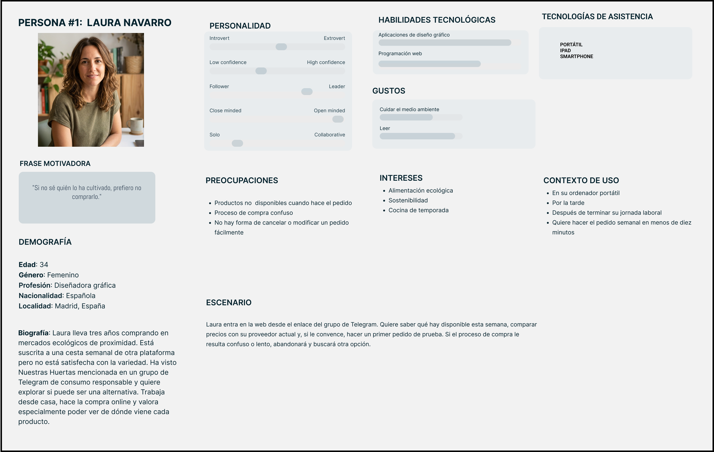
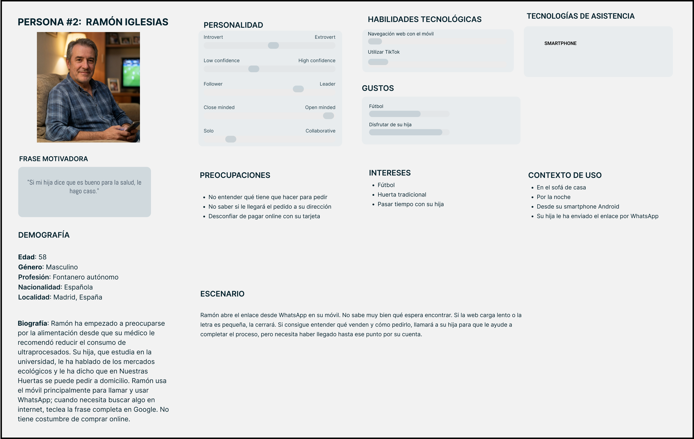
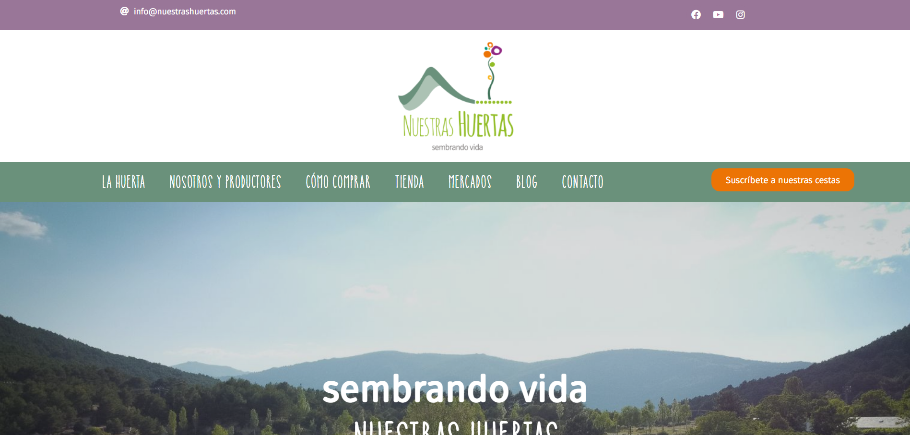
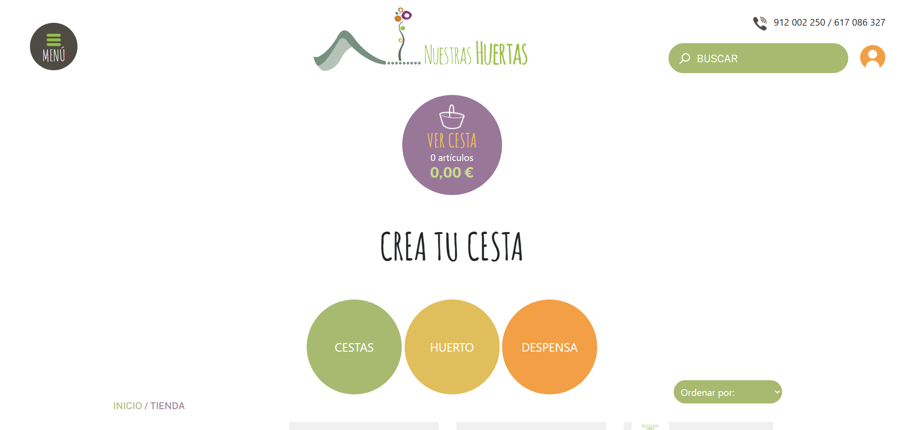
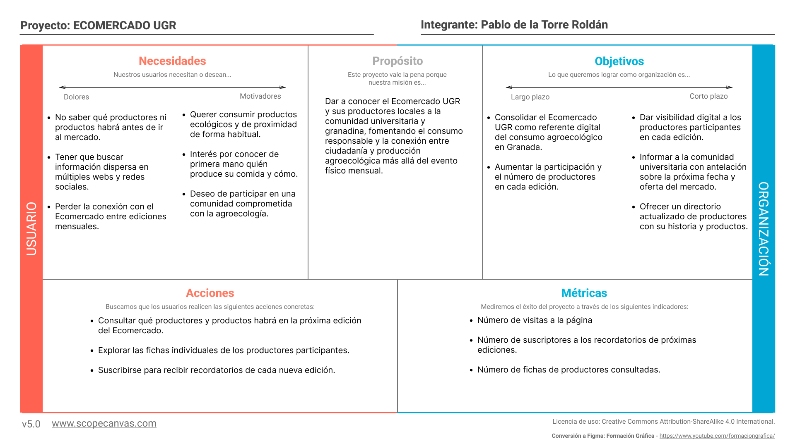
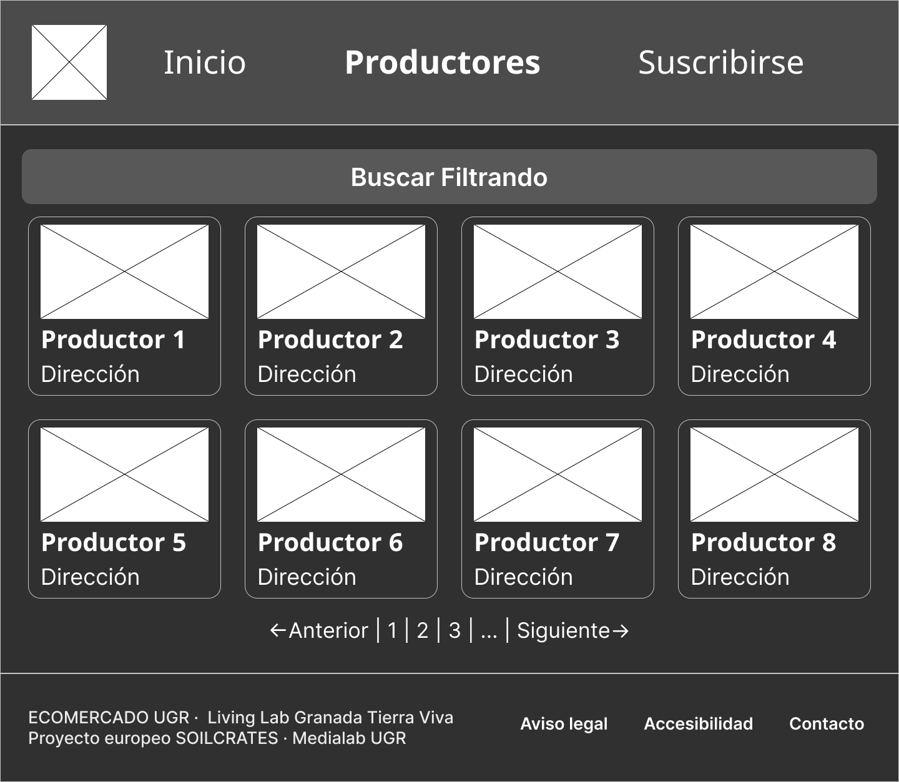
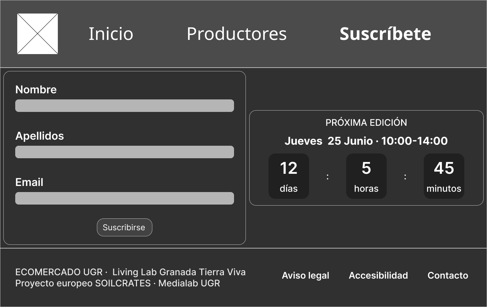

# Caso de estudio: Propuesta de diseño ECO MERCADO UGR
Pablo de la Torre Roldán

# Análisis de Nuestras Huertas
## Elección de la página web a estudiar
He decidido elegir [Huerta Madrid](https://www.nuestrashuertas.com/) como página web para estudiar. Vamos a analizar el diseño, usabilidad, accesibilidad, adaptación a diferentes dispositivos y la experiencia de usuario. 

Antes de analizar el diseño, debemos ponernos en contexto, al igual que hicimos en la parte 1 de prácticas (Research Plan + Persona).

### Contexto (Research Plan reducido)
Nuestras Huertas es una iniciativa de agricultura ecológica ubicada en Bustarviejo, Sierra Norte de Madrid. Su propuesta combina una tienda online de frutas y verduras ecológicas de temporada con un mercado físico a pie de huerta, entrega a domicilio en municipios de la Comunidad de Madrid y una filosofía de proximidad entre productor y consumidor.

En este estudio queremos analizar la experiencia de usuario en su sitio web (nuestrashuertas.com), fijándonos en cómo los usuarios descubren los productos disponibles, comprenden el proceso de compra, localizan los puntos y horarios del mercado físico y completan un pedido. El análisis se realiza desde el punto de vista de potenciales clientes con perfiles de distinta experiencia digital y distinta motivación de compra.

Los potenciales usuarios de este sistema son:

Laura es el claro ejemplo de consumidora ecologista y altamente adaptada a los entornos digitales, mientras que Ramón es un padre de familia con baja experiencia digital.

## Análisis del diseño
El primer problema que he detectado al entrar en nuestrashuertas.com es que el header ocupa aproximadamente dos tercios de la pantalla visible, independientemente del dispositivo. La parte que el usuario ve sin hacer scroll es la más valiosa de cualquier página web, ya que es lo único garantizado que el usuario verá antes de decidir si continúa o abandona. Desperdiciar ese espacio con el logo de la empresa en un tamaño innecesariamente grande es un error muy grave. Esta es la primera vista que da la página.

Este mismo problema se repite en la página de pedidos online. En vez de mostrar los productos disponibles en una lista, lo primero que encontramos es un botón arriba del todo para el carrito (lo cual significa que solo tenemos acceso al carrito si estamos al inicio de la página) y 3 menús desplegables para filtrar los productos. Tanto el botón del carrito como los de los filtros son innecesariamente grandes, provocando que al igual que en la página principal, el contenido importante no se pueda ver de un vistazo. Esto es lo primero que se ve al entrar a la página de pedidos online:

Los colores elegidos para la página de pedidos son similares a los de la página principal. Sin embargo, el diseño no es consistente, ya que perdemos el Navbar principal por un menú de tipo botón, perdemos el color del header y tenemos un diseño mucho más plano (sin imágenes…).

Además, la página principal no tiene una intención clara de mostrar la acción que se quiere que el usuario realice de forma clara. Si la acción principal de la página es pedir online, se debería hacer hincapié en ella, poniendo botones que lleven a ella o los últimos productos…

La fuente utilizada para los títulos (Catalina Anacapa sans) me parece apropiada para el contexto y el público al que va dirigida. Tiene un estilo rústico, natural y amigable, perfecto para una página de agricultura ecológica, natural y sostenible. La fuente de los párrafos es Fuse sans, perfecta para leer sin cansar los ojos. 

La elección de la paleta de colores es apropiada, ya que el color principal es el verde (símbolo de naturaleza) y el color de acento es naranja cálido, complementando bien al verde sin ser demasiado agresivo. El texto de los párrafos está de color gris, lo que puede suponer un problema para personas con discapacidad visual. Necesita más contraste.

Algunos colores y fuentes de la página para pedir online cambian. Esto es un problema y se debe mantener la consistencia entre ambos (ya se ha mencionado anteriormente).

## Análisis de usabilidad
###	Problema 1: Header sobredimensionado en página principal
- El logo ocupa aproximadamente dos tercios del header, dejando sin contenido útil la zona más valiosa de la página. El usuario no recibe ninguna información sobre qué vende el sitio ni qué acción debe realizar. El usuario llega con preguntas concretas que la página no responde en los primeros segundos críticos de decisión.
- Recomendación: Reducir el logo a un tamaño estándar de header e incorporar en el espacio liberado un titular claro, los productos de la semana y un CTA hacia la tienda.
	
### Problema 2: Página de tienda sin productos visibles al entrar
- La página de pedidos online reproduce el mismo error: lo primero visible es un botón de carrito de tamaño excesivo y tres menús desplegables de filtrado, también sobredimensionados. Los productos no son visibles sin hacer scroll. Dos pantallas consecutivas sin contenido relevante acumulan frustración antes de que el usuario haya visto un solo producto.
- Recomendación: Reducir el tamaño del botón de carrito y los filtros, y mostrar los productos directamente al entrar. El carrito debe ser accesible en todo momento (header fijo o elemento flotante), no solo desde la parte superior.

### Problema 3: Ausencia de CTA claro en la página principal
- La página principal no comunica ninguna acción prioritaria. Si el objetivo del sitio es que el usuario realice un pedido, debe existir un botón prominente que lleve a la tienda, acompañado de información de contexto (productos disponibles esta semana, estado de la tienda).
- Recomendación: Incluir un CTA principal en la hero section del tipo "Ver productos de esta semana" y mostrar una muestra de productos en la página principal.

### Problema 4: Inconsistencia visual entre página principal y tienda
- El cambio de la página principal a la tienda online supone una ruptura visual perceptible: desaparece el Navbar principal (sustituido por un menú de tipo botón), se pierde el color del header, desaparecen las imágenes y el diseño se vuelve considerablemente más plano. Algunos colores y fuentes también varían. El usuario puede percibir que ha abandonado el sitio, rompiendo los modelos mentales construidos durante la navegación inicial.
- Recomendación: Unificar el sistema de diseño entre ambas páginas: mismo navbar, mismo header, misma paleta y mismas fuentes.

### Problema 5: Contraste insuficiente en texto de párrafos
- El texto de los párrafos se presenta en color gris sobre fondo claro, lo que puede suponer un problema para usuarios con baja visión o en condiciones de luz ambiental alta. La elección tipográfica es acertada (Fuse Sans para cuerpo de texto), pero el color no cumple los ratios de contraste recomendados por las WCAG (mínimo 4.5:1 para texto normal).
- Recomendación: Oscurecer el color del texto de párrafo para garantizar un contraste mínimo de 4.5:1.
	

## Usability Report
[Enlace al usability report](usability_report.pdf)

## Análisis de Accesibilidad
La página tiene una valoración del 56% en el test de accesibilidad. Aunque la web tenga fuentes grandes para los usuarios con baja visión y localizar elementos como el blog sea fácil, el sitio presenta fallos críticos que hacen que la experiencia de usuario decaiga.

Las conclusiones más importantes han sido el incumplimiento de las pautas WCAG (ellos mismos los enumeran en su página de [declaración de accesibilidad](https://www.nuestrashuertas.com/declaracion-accesibilidad/)) y el bajo contraste de los párrafos.
 
 [Enlace a la evaluación de accesibilidad](evaluacion_accesibilidad.pdf)

--- 

# Propuesta de valor para ECOMERCADO UGR
## Insights de ECOMERCADO UGR
### Contexto
El Ecomercado UGR es una iniciativa mensual celebrada en los Paseíllos Universitarios del Campus de Fuentenueva (Universidad de Granada), impulsada conjuntamente por la propia UGR y la Red Agroecológica de Granada (RAG). Nace en marzo de 2026 en el marco del proyecto europeo SOILCRATES y su living lab Granada Tierra Viva, coordinado desde Medialab UGR.

Pretende convertir la universidad en un agente activo en la transformación de los sistemas alimentarios, fomentando modelos más sostenibles, saludables y conectados con el territorio.

### Insight 1: Sin presencia digital
Ecomercado genera una experiencia rica en su formato presencial: contacto directo con productores, actividades paralelas de debate y formación, diversidad de iniciativas locales. Sin embargo, carece de una presencia digital propia que refleje esa riqueza. Todo el valor del evento desaparece para quienes no asisten.

### Insight 2: Periodicidad mensual sin subscripción
Ecomercado aspira a consolidarse como cita mensual estable (cada cuarto jueves del mes). Sin embargo, no existe actualmente ningún canal digital propio (ni web, ni app, ni newsletter) que recuerde al usuario cuándo es la próxima edición ni le informe de las novedades. 

### Insight 3: Información descentralizada
La información del Ecomercado está dispersa entre el canal de noticias de la UGR, Medialab UGR, El Independiente de Granada, la web de Impronta Granada y posiblemente redes sociales. No existe un sitio web ni aplicación propia del Ecomercado UGR. Si un usuario quiere enterarse de todo acerca del Ecomercado, debe navegar por múltiples páginas distintas.

## Propuesta de valor para ECOMERCADO UGR
Actualmente, el Ecomercado UGR carece de una plataforma digital propia que le permita extender su impacto más allá del evento físico mensual. La comunidad universitaria interesada no dispone de una web digital.

Dicha plataforma podría permitir:
- Saber con antelación qué productores y productos habrá en cada edición.
- Conocer la historia e identidad de los productores participantes. 
- Recibir recordatorios de las próximas fechas.

## Boceto propuesto para la web (Wireframe)
Como ya hemos visto en la propuesta de valor, la web debe tener una página inicial que muestre información relevante sobre el Ecomercado (próxima fecha, imágenes de las anteriores ediciones…), además de las páginas de cada una de las ediciones, identidad de cada productor participante y subscripción a recordatorios. Este ha sido el diseño del wireframe de cada una de las páginas:

Página principal: Buscamos tener a mano las opciones principales (suscribirse al recordatorio y conocer a los productores), además de informar rápidamente de cuándo es la siguiente edición.

Página productores: En ella se puede hacer click a cada uno de los productores para entrar en una página más detallada sobre los datos del productor seleccionado. Se utiliza el botón de filtros para filtrar los productores por sus características.

Página Suscríbete: Permiten que los usuarios se suscriban a nuevas ediciones de ECOMERCADO UGR. Consta de un formulario básico de nombre, apellidos y email, además de la cuenta atrás al evento. Cuando el usuario se suscribe, le llega un correo de recordatorio X tiempo antes de que inicie el evento. 

---

# Conclusiones y análisis con las prácticas
Para este estudio sería sumamente interesante aplicar las técnicas de prototipado (mockup) que hicimos en la práctica 3, para terminar con una aplicación implementada y semi-funcional. 

Además, podríamos haber hecho un user research plan antes de comenzar con el análisis de Nuestra Huerta, para tener un poco más de información de contexto antes de empezar a trabajar.

El Competitor Analysis de las prácticas fue mucho más directo y extenso que el análisis de Nuestra Huerta. Aunque también ha servido para identificar los principales errores de nuestro competidor (header my grande, inconsistencias entre páginas, problemas de rendimiento…).
